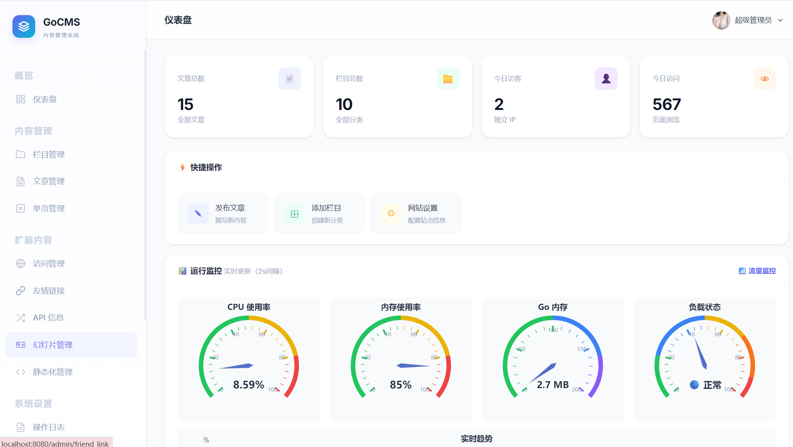
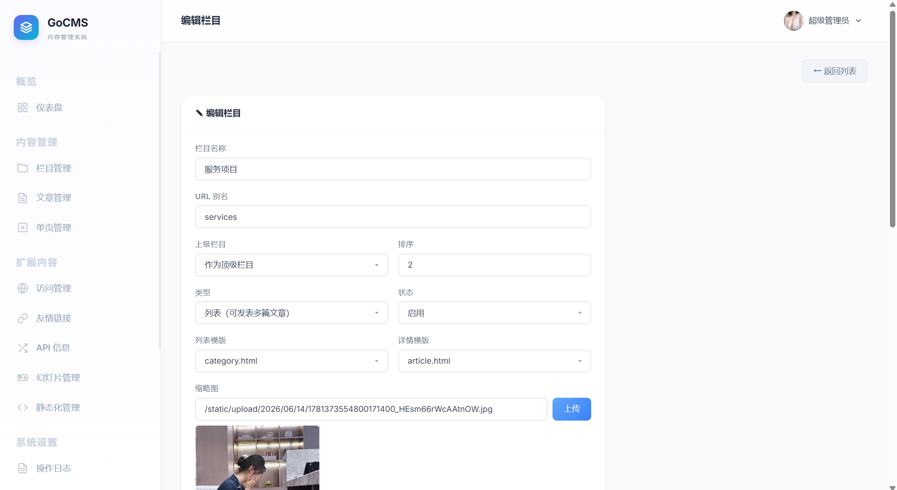
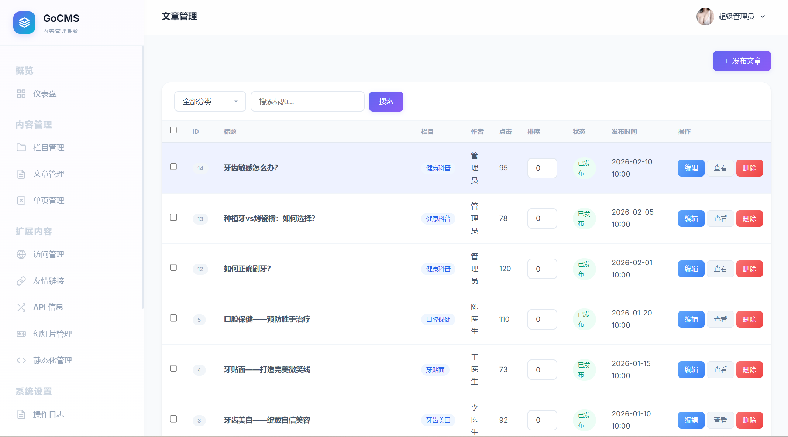
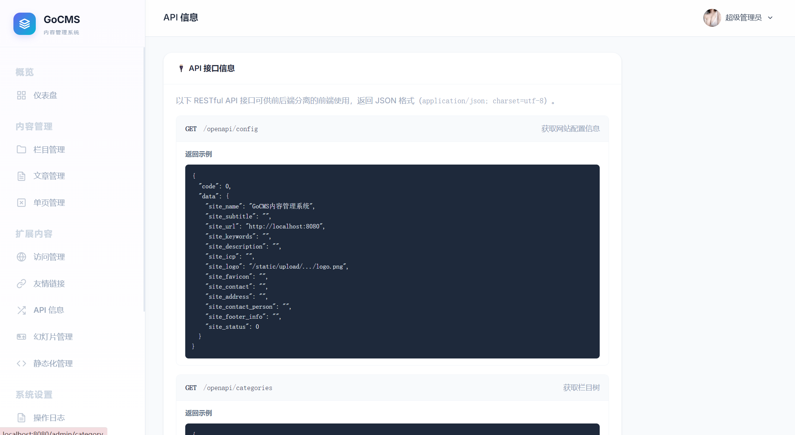
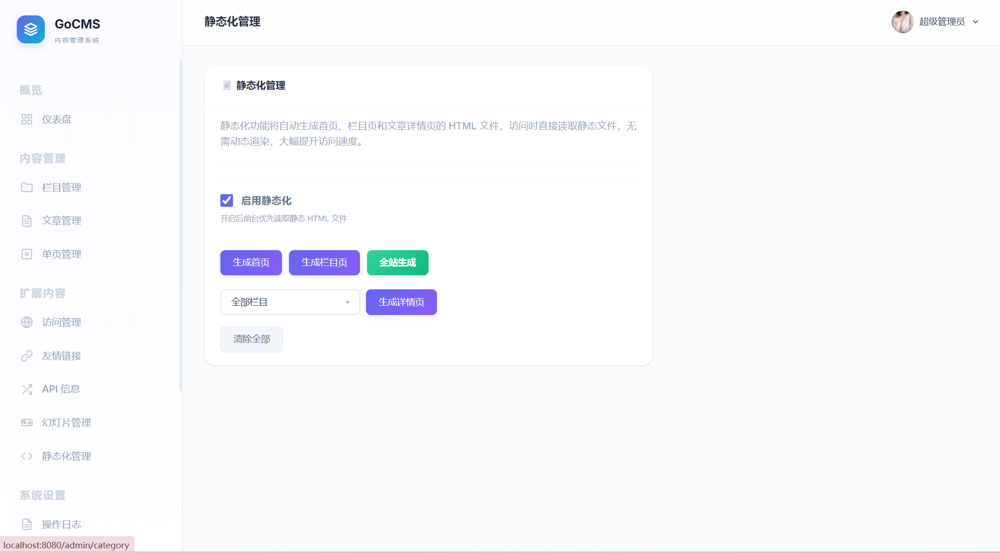
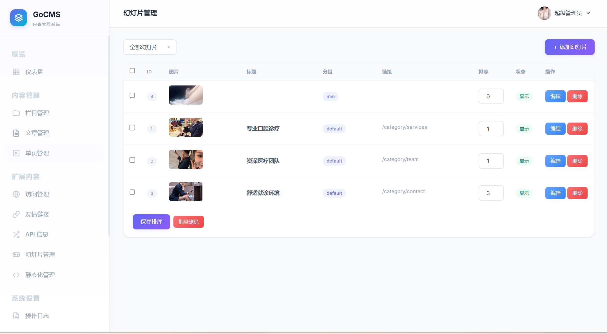

# GoCMS 内容管理系统 - 使用手册

演示地址[ Eagle-Gocms](https://gocms.eagleclouds.com)

## 目录

1. [系统概述](#1-系统概述)
2. [登录与个人设置](#2-登录与个人设置)
3. [仪表盘](#3-仪表盘)
4. [内容管理](#4-内容管理)
5. [扩展内容](#5-扩展内容)
6. [系统设置](#6-系统设置)
7. [API 接口](#7-api-接口)
8. [静态化与 Sitemap](#8-静态化与-sitemap)

---

## 1. 系统概述

GoCMS 是一个基于 Go 语言开发的内容管理系统，采用 Gin + GORM + SQLite 技术栈。系统特点：

- **单二进制部署**：无需安装数据库和 Web 服务器，一个 exe 文件即可运行
- **牙科诊所主题**：内置完整的前端展示页面，适合医疗/牙科行业
- **前后端分离 API**：提供完整的 RESTful JSON API，可对接 Vue/React 等前端框架
- **静态化生成**：支持将动态页面生成为静态 HTML 文件，提升访问速度

### 1.1 启动系统

```
gocms.exe
```

系统默认运行在 `http://localhost:8080`，管理员账号 `admin / admin123`。

### 1.2 目录结构

```
F:\Vibe\Gocms\
├── gocms.exe          # 可执行文件
├── config.json        # 服务器配置文件
├── sitemap.xml        # 自动生成的网站地图
├── data/
│   └── gocms.db       # SQLite 数据库文件
├── static/
│   ├── html/          # 静态化生成的 HTML 文件
│   ├── upload/        # 上传文件存储目录
│   ├── css/           # 样式文件
│   └── js/            # JavaScript 文件
└── templates/         # 模板文件
    ├── admin/         # 后台管理模板
    └── frontend/      # 前端展示模板
```

---

## 2. 登录与个人设置

### 2.1 登录

访问 `http://localhost:8080/admin/login` 进入登录页。

- 输入用户名和密码
- 输入验证码（点击验证码图片可刷新）
- 同一 IP 15 分钟内连续失败 5 次将被临时锁定

### 2.2 个人设置

登录后点击右上角头像区域，选择"个人设置"，可修改：

| 字段 | 说明 |
|------|------|
| 头像 | 点击头像区域上传新图片 |
| 昵称 | 修改显示名称 |
| 旧密码 | 修改密码时需验证旧密码 |
| 新密码 | 留空则不修改密码 |

### 2.3 退出登录

点击右上角头像 → 退出登录。

---

## 3. 仪表盘

仪表盘是登录后的首页，展示网站核心数据：

### 3.1 统计数据
- **文章总数**：系统中所有文章数量
- **栏目总数**：所有栏目数量
- **今日访客**：今日独立 IP 访问数
- **今日浏览量**：今日总页面访问次数

### 3.2 快捷操作
- 新建文章
- 新建栏目
- 网站设置

### 3.3 运行监控（实时）
- **CPU 使用率**：服务器 CPU 百分比
- **内存使用率**：服务器内存百分比
- **Go 内存**：Go 运行时内存占用
- **负载状态**：综合 CPU×60% + 内存×40% 计算，分五级（空闲/正常/较高/繁忙/满载）
- **上行/下行速度**：网络流量实时监控（KB/s），点击"📶 流量监控"展开
- **趋势图**：60 个采样点的实时趋势曲线

---

## 4. 内容管理

### 4.1 栏目管理

管理网站栏目结构，支持无限层级嵌套。

#### 栏目列表
- 以树形结构展示所有栏目，显示缩进层级
- 每个栏目显示：名称、别名、类型、排序、状态

#### 栏目操作
| 操作 | 说明 |
|------|------|
| 新增 | 填写名称、别名（URL 友好名称）、选择父栏目 |
| 编辑 | 修改栏目信息，包括 SEO 关键词、描述、Banner 图 |
| 删除 | 删除栏目（有子栏目或文章时不可删除） |
| 排序 | 输入排序数字，点击"保存排序" |

#### 栏目字段说明

| 字段 | 说明 |
|------|------|
| 名称 | 栏目显示名称 |
| 别名 | URL 中使用的英文标识（如 `about`, `services`） |
| 父栏目 | 上级栏目，留空为顶级栏目 |
| 类型 | `列表`：显示文章列表；`单页`：显示单篇文章内容 |
| 图片 | 栏目配图 |
| Banner | 栏目页顶部横幅图片 |
| 关键词 | SEO 关键词 |
| 描述 | SEO 描述 |
| 列表模板 | 栏目列表页使用的模板文件（从 `templates/frontend/` 自动读取） |
| 详情模板 | 文章详情页使用的模板文件 |

### 4.2 文章管理

管理网站文章内容。

#### 文章列表
- 按栏目筛选（支持层级下拉框）
- 按关键词搜索
- 表格展示：ID、标题、栏目、作者、点击量、状态（发布/草稿）、置顶、时间
- 支持批量删除

#### 文章操作
| 操作 | 说明 |
|------|------|
| 新增 | 填写标题、选择栏目、编辑内容 |
| 编辑 | 修改文章所有字段 |
| 删除 | 单个删除或批量删除 |
| 排序 | 输入排序数字，点击"保存排序" |
| 置顶 | 设置文章是否置顶显示 |

#### 文章字段说明

| 字段 | 说明 |
|------|------|
| 标题 | 文章标题 |
| 栏目 | 所属栏目（支持层级选择） |
| 关键词 | SEO 关键词 |
| 描述 | 文章摘要 |
| 缩略图 | 文章封面图 |
| 作者 | 文章作者 |
| 来源 | 文章来源 |
| 内容 | 富文本编辑器（支持 WangEditor 和 UEditor 双编辑器切换） |
| 排序 | 在栏目内的排序 |
| 状态 | 发布/草稿 |

### 4.3 单页管理

管理类型为"单页"的栏目。单页栏目通常用于"关于我们"、"联系我们"等独立页面。

- 列表展示所有单页栏目
- 单页内容在栏目编辑中直接填写

---

## 5. 扩展内容

### 5.1 访问管理

记录网站访问日志。

| 功能 | 说明 |
|------|------|
| 查看 | 按日期倒序显示访问记录（日期、IP、路径、User-Agent） |
| 分页 | 每页 10 条，支持滑动页码±3 页 |
| 批量删除 | 选中多条记录后删除 |
| 清空全部 | 一键清空所有访问记录 |

### 5.2 友情链接

管理网站底部的友情链接。

| 字段 | 说明 |
|------|------|
| 名称 | 链接显示文字 |
| 链接 | 目标 URL |
| Logo | 链接图标 |
| 排序 | 显示顺序 |
| 状态 | 显示/隐藏 |

**批量操作**：支持全选 → 批量删除。

### 5.3 API 信息

查看系统提供的所有 RESTful API 接口文档，包括：

- 请求方法（GET）
- 接口路径
- 参数说明（路径参数 / 查询参数）
- 返回 JSON 示例

### 5.4 幻灯片管理

管理首页和关于页等位置的幻灯片/轮播图。

#### 分组管理
幻灯片支持分组管理，每个幻灯片可设置分组名称（默认 `default`）。

| 功能 | 说明 |
|------|------|
| 列表 | 表格显示图片预览、标题、分组、链接、排序、状态 |
| 分组筛选 | 顶部下拉框按分组过滤显示 |
| 新增 | 上传图片 + 填写分组名称 |
| 分组快速设置 | 表单页显示已有分组标签，点击自动填入 |

#### 幻灯片字段

| 字段 | 说明 |
|------|------|
| 图片 | 幻灯片图片 |
| 标题 | 幻灯片标题 |
| 链接 | 点击跳转链接 |
| 分组 | 分组名称（留空为 `default`） |
| 排序 | 显示顺序 |
| 状态 | 显示/隐藏 |

### 5.5 静态化管理

将动态页面生成为静态 HTML 文件，大幅提升访问速度。

#### 使用流程

1. **启用静态化**：勾选"启用静态化"开关
2. **生成静态文件**（点击对应按钮）：
   - **生成首页**：仅生成首页
   - **生成栏目页**：生成所有栏目列表页（含分页）
   - **生成详情页**：生成所有文章详情页（可按栏目筛选）
   - **全站生成**：一次性生成首页 + 栏目页 + 详情页
3. **清除全部**：清除所有已生成的静态文件

#### 静态文件存储位置

```
static/html/
├── index.html                      # 首页
├── category/
│   ├── services.html               # 栏目页
│   ├── services_2.html             # 栏目分页
│   └── ...
└── article/
    ├── 1.html                      # 文章详情
    ├── 2.html
    └── ...
```

**注意**：静态化启用后，前台将直接读取 HTML 文件。修改内容后需重新生成对应的静态页面。

---

## 6. 系统设置

### 6.1 操作日志

记录所有管理员在后台的操作行为。

| 字段 | 说明 |
|------|------|
| 操作 | 登录/新增/修改/删除 |
| 目标 | 文章/栏目/幻灯片等 |
| 详情 | 具体操作描述 |
| 操作人 | 管理员用户名 |
| IP | 操作来源 IP |
| 时间 | 操作时间 |

**批量操作**：支持批量删除和清空全部。

### 6.2 Sitemap

自动生成 `sitemap.xml` 文件，帮助搜索引擎收录网站内容。

| 功能 | 说明 |
|------|------|
| 生成 | 一键生成包含首页、所有栏目页和文章页的 Sitemap |
| 查看文件 | 直接访问 `/sitemap.xml` |
| 统计显示 | 上次生成时间、URL 数量 |

生成内容包含：首页（priority 1.0）、栏目页（priority 0.8，含描述）、文章页（priority 0.6，含标题、描述、发布日期）。

### 6.3 网站配置

配置网站基本信息。

| 字段 | 说明 |
|------|------|
| 网站名称 | 站点标题 |
| 副标题 | 一句话描述 |
| 网站 URL | 网站完整 URL |
| 关键词 | 首页 SEO 关键词 |
| 描述 | 首页 SEO 描述 |
| ICP 备案号 | 网站备案号 |
| Logo | 网站 Logo（可上传） |
| Favicon | 网站图标（支持 .ico 格式） |
| 联系人、联系方式、地址 | 公司信息 |
| 尾部信息 | 页脚显示的自定义文字 |
| 统计脚本 | 插入到页面底部的统计代码 |
| 每页条数 | 前端分页每页显示文章数 |
| 启用 OpenAPI | 开启后可通过 `/openapi/...` 访问 JSON 数据 |

### 6.4 系统配置

| 字段 | 说明 |
|------|------|
| 默认作者 | 新增文章时默认填入的作者名 |
| 操作日志保留天数 | 自动清理超过指定天数的操作日志（0 为永久保留） |
| 访问日志保留天数 | 自动清理超过指定天数的访问日志 |
| 关闭网站 | 开启后前台显示维护提示 |
| 关闭提示 | 自定义关闭提示文字 |

### 6.5 用户管理

管理后台管理员账号。

| 操作 | 说明 |
|------|------|
| 新增 | 添加新的管理员（用户名、密码、昵称、角色） |
| 编辑 | 修改管理员信息 |
| 重置密码 | 独立页面设置新密码，含确认密码验证 |
| 启用/禁用 | 切换管理员账号状态 |
| 删除 | 删除管理员（无法删除根管理员） |

**头像**：管理员可上传头像，在右上角显示。

### 6.6 角色管理

管理角色和权限分配。

| 角色 | 权限范围 |
|------|----------|
| 超级管理员 | 所有权限（不可删除/编辑） |
| 管理员 | 内容管理、扩展内容、配置管理等运营权限 |
| 编辑 | 内容管理（栏目、文章、单页） |
| 访客 | 仅查看仪表盘和内容列表 |

**权限分配**：编辑角色时，通过复选框精确分配每个功能的查看/新增/编辑/删除权限。

---

## 7. API 接口

系统提供 RESTful JSON API，支持前后端分离开发。需先在网站配置中启用 OpenAPI 开关。

### 7.1 接口列表

| 方法 | 路径 | 说明 |
|------|------|------|
| GET | `/openapi/config` | 获取网站配置 |
| GET | `/openapi/categories` | 获取栏目树 |
| GET | `/openapi/categories/:id` | 获取栏目信息及子栏目 |
| GET | `/openapi/categories/:id/articles?page=1&pagenum=10` | 获取栏目下文章列表 |
| GET | `/openapi/articles/:id` | 获取文章详情 |
| GET | `/openapi/slides?group=default` | 获取幻灯片列表 |
| GET | `/openapi/friend_links` | 获取友情链接列表 |

### 7.2 调用说明

- 基础 URL：`http://localhost:8080/openapi`
- 响应格式：统一 `{"code": 0, "data": {...}}`（成功）或 `{"code": 1, "msg": "..."}`（失败）
- 编码：`application/json; charset=utf-8`
- CORS：允许所有跨域请求

---

## 8. 静态化与 Sitemap

### 8.1 静态化工作流程

```
编辑内容 → 启用静态化 → 生成静态文件 → 前台读取 .html 文件
```

- 修改内容后必须重新生成对应的静态页面
- 静态文件尾部自动追加生成时间注释
- 关闭静态化后，前台恢复动态渲染

### 8.2 Sitemap

- 生成文件位置：`sitemap.xml`（项目根目录）
- 访问地址：`http://localhost:8080/sitemap.xml`
- 包含内容：首页、所有栏目页、所有文章详情页
- 收录优先级：首页 1.0 > 栏目页 0.8 > 文章页 0.6

---

## 附录

### A. 配置文件说明

`config.json` 文件（项目根目录）：

```json
{
  "db_path": "data/gocms.db",
  "port": ":8080",
  "admin_user": "admin",
  "admin_pass": "admin123",
  "secret_key": "gocms-secret-key-2024"
}
```

环境变量 `PORT` 可覆盖配置文件中的端口。

### B. 数据备份

数据库文件位于 `data/gocms.db`，直接复制该文件即可完成备份。上传文件位于 `static/upload/` 目录。

### C. 权限矩阵

| 功能模块 | 查看 | 新增 | 编辑 | 删除 |
|----------|------|------|------|------|
| 仪表盘 | ✅ | - | - | - |
| 栏目管理 | ✅ | ✅ | ✅ | ✅ |
| 文章管理 | ✅ | ✅ | ✅ | ✅ |
| 单页管理 | ✅ | ✅ | ✅ | ✅ |
| 幻灯片 | ✅ | ✅ | ✅ | ✅ |
| 友情链接 | ✅ | ✅ | ✅ | ✅ |
| 静态化管理 | ✅ | ✅生成 | - | ✅清除 |
| 操作日志 | ✅ | - | - | ✅ |
| 访问管理 | ✅ | - | - | ✅ |
| 配置管理 | ✅ | - | ✅ | - |
| 管理员管理 | ✅ | ✅ | ✅ | ✅ |
| 角色管理 | ✅ | ✅ | ✅ | ✅ |
| API 信息 | ✅ | - | - | - |
| Sitemap | ✅ | - | ✅生成 | - |







 

